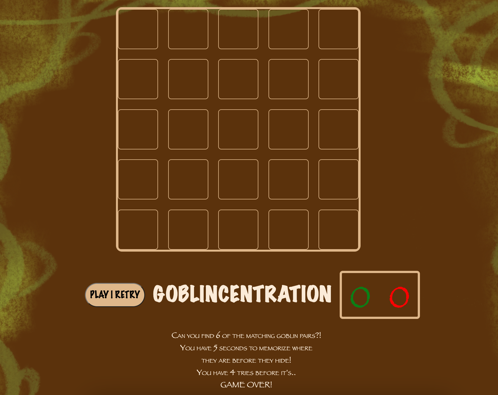
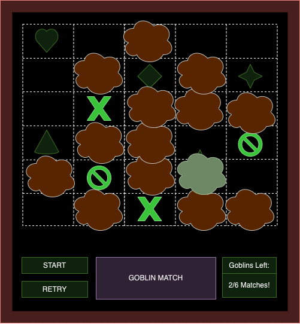

# Project-1---GAME

# # Goblincentration (or.. Goblin-Match) # #
  -- A buncha goblins are hiding from you in the brush! Can you match them all? --
## ScreenShot & Wireframe



## User Stories
- As a user, I want to...
  - click play to start game
  - see initial layout of cards
  - watch goblins randomize with 5 seonds to memorize
  - watch goblins hide in the forest
  - click on spots one at a time to reveal underlying goblins matches
  - be told when a match is incorrect
  - be told when a m,atch is correct
  - told when the game has completed
  - option to replay game

## Technologies Used
- HTML5
- CSS3
- JavaScript

## Future Features
- animations for goblins randomizing
- update grid styling
- sound effects / music
- changeable difficulty (more matches needed to win)
- holding area to show visually what choices you make
- win/lose graphics instead of just a message

##### Font
```css
font-family: fantasy;
```